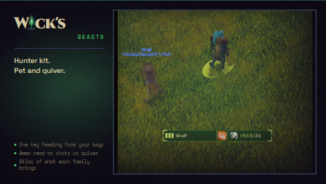

# Wick's Beasts and Things

> Hunter loadout kit for World of Warcraft: Forever. Pet care with one-key feeding, ammo watch, talents, pre-pull checklist, racials.

Part of the **[Wick suite](https://github.com/Wicksmods/WickSuite)**: precision addons built around a single fel-green-on-deep-purple aesthetic. Built on [WickCore](https://github.com/Wicksmods/WickCore).

## What it is

A hunter's setup is a pet and a quiver. This kit keeps both in view and
handles the chore that every hunter repeats a hundred times: feeding.

- **Pet card.** Name, family, level, happiness with damage bonus and loyalty
  direction, loyalty rank, free training points, and what the pet eats.
- **Feed key.** One keybind that casts Feed Pet and uses the best food in
  your bags that this pet will actually eat, judged by the client's own
  diet check and the level rule. Pin a specific food with a slash command
  when you would rather burn the cheap stuff.
- **Ammo watch.** What is in the ammo slot, how many shots are equipped and
  in reserve, and whether it matches the weapon. Red below your threshold
  or when arrows meet a gun.
- **Talents.** Export the active build as a Blizzard import string, import a
  string as a new loadout, save builds to an account-wide library, apply one
  with a click.
- **Pre-pull checklist.** Aspect up, pet out, pet fed, ammo stocked, Trueshot
  Aura once you have it. Rows go quiet the moment combat starts.
- **Racials.** Your race's actives as cast buttons with cooldown display.

## Install

Requires **[WickCore](https://github.com/Wicksmods/WickCore)**. Extract both
folders into the Forever client's `Interface\AddOns\`.

## Usage

Bind **Feed pet** and **Toggle pet and ammo panel** under Key Bindings,
AddOns, Wick's Beasts and Things.

| Command | Effect |
|---|---|
| `/wbt` | Pet and ammo panel |
| `/wbt kit` | Talents, checklist, racials |
| `/wbt options` | Options page |
| `/wbt ammo <count>` | Warn below this many shots |
| `/wbt food [item link]` | Pin a food for the feed key |
| `/wbt food clear` | Back to the best food in bags |
| `/wbt status` | Diagnostics |

`/wbeasts` is an alias.

## Compatibility

World of Warcraft: Forever, 1.60.x, Interface 16001. Requires WickCore.

## License

MIT for code (see [LICENSE](LICENSE)). Brand chrome and the "Wick's" wordmark are trademarked, see [TRADEMARK.md](https://github.com/Wicksmods/WickSuite/blob/main/TRADEMARK.md). Racial data from [talentsforever.com](https://talentsforever.com) (CC BY 4.0) via WickCore.
